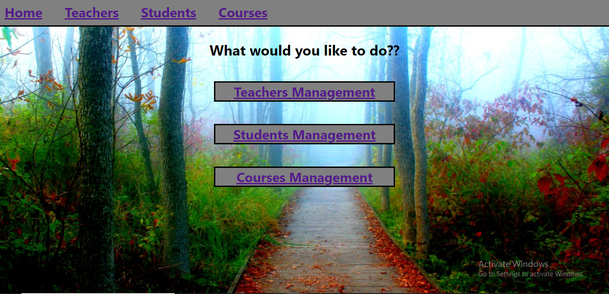
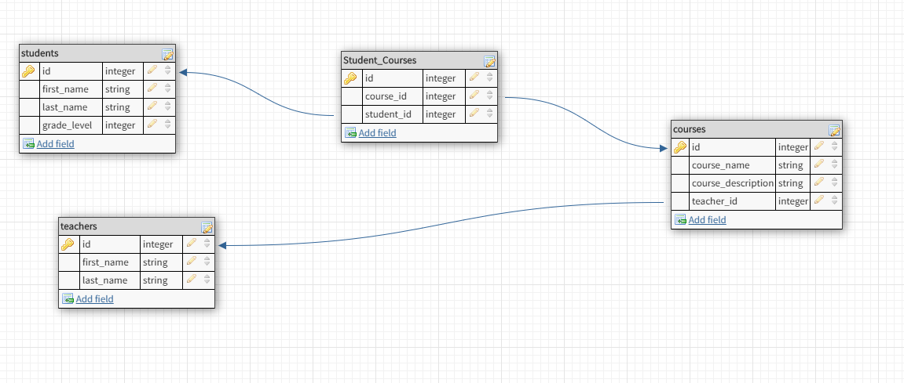

# Schoolizer
### A school orginizer web app that makes it easy for you as a manager to control your school by managing your teachers,students and courses taught in the school...

###[Schoolizer on Heroku]()
###[Schoolizer on Github]()

# Who is this app for?
It is for school managers who are tired  tired of using excel sheets and paperwork to manage thier schools...
# How to install it ??
You can visit this site to open the app 
[Schoolizer App ]()
# How to use it?
 In very easy and simple steps you can build your own school by just choosing the feature you need (student/teacher/courses)...
 Then you can choose one of the operations listed in each feature(show,add, edit)...
 Once you are done, you can easily go back to the home page....
 You'll see a header appears in each page that has main features of the app (Home,Teachers,Students,courses)...You can click on any of these any time and go that feature to do some fun operations...
## Some basic Operations to do with the app:
### Showing/editing all teachers
You can view all teachers teaching in your school by clicking show teachers from the Teachers Feature...
Once you click, you'll see a list of teachers...In order to get more information about a specific teacher,just click on the MoreInfo button of that teacher...
Once you got the info, you can edit that teacher or go back to the list of the teachers...
If you click edit,you'll see a form with info already filled..you can update this info and then click update
### Adding a new Teacher
You can add a new teacher by clicking on Add new teacher button in the Teachers Feature... 
fill the form with the info of that new teacher and then click on Add when you finish... 
### Showing/editing/adding Students
The same steps as mentioned in the teachers feature.
### Courses
The same steps as above.However, you must be aware when you add/edit a course that you should put an available id for the teacher who is teaching this course(teacher_id),otherwise:it will cause an error...
If you don't know the teacher's Id, you can leave it blank..

# Technologies
> This is a full stack app built with node.js/express.js for the BackEnd Routing and API...
> It is also build in React for the FrontEnd components...
>For Styling it is using CSS/html....
>For the database it is using the psql database

# WireFrames
[Click Here to see the wireFrames](./Wire_Frames) 

# Schema Diagram

